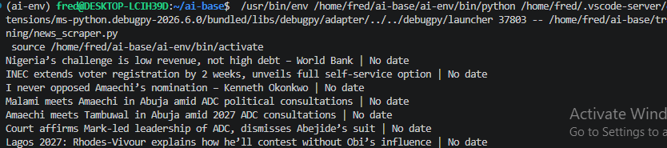

# Vanguard News Scraper

A beginner Python web scraping project that extracts the latest headlines from Vanguard Nigeria and saves them to a CSV file.

## Features

- Scrapes latest headlines
- Extracts publication dates
- Saves results to CSV
- Uses BeautifulSoup and Requests

## Technologies

- Python
- Requests
- BeautifulSoup4
- lxml

## Installation

```bash
pip install -r requirements.txt
```

## Usage

```bash
python news_scraper.py
```

## Example Output

| Title | Date |
|-------|------|
| Example headline | July 2, 2026 |

## Screenshot


## Disclaimer

This project is intended for educational purposes.
Always respect a website's Terms of Service and robots.txt when scraping.